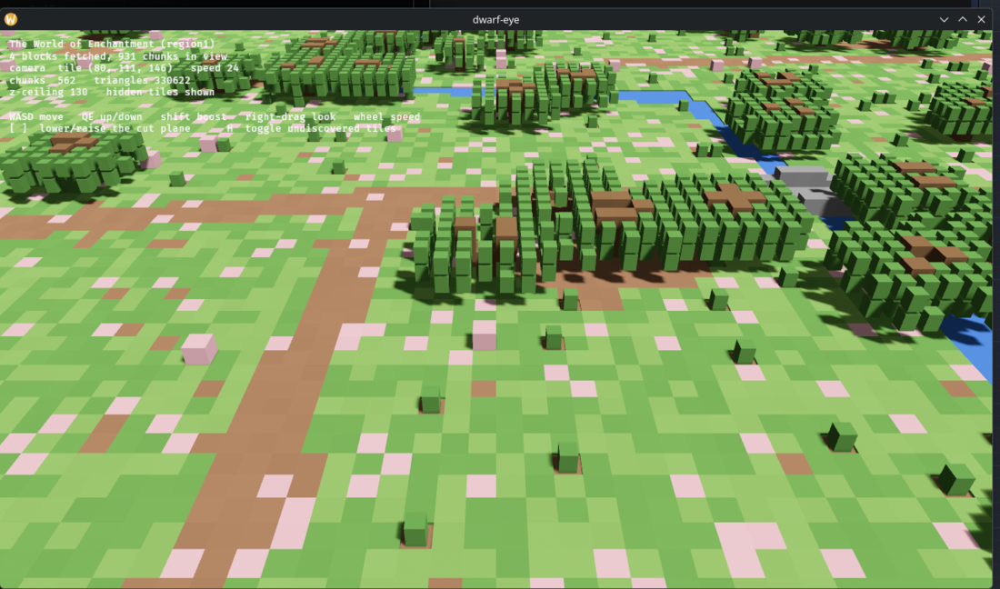
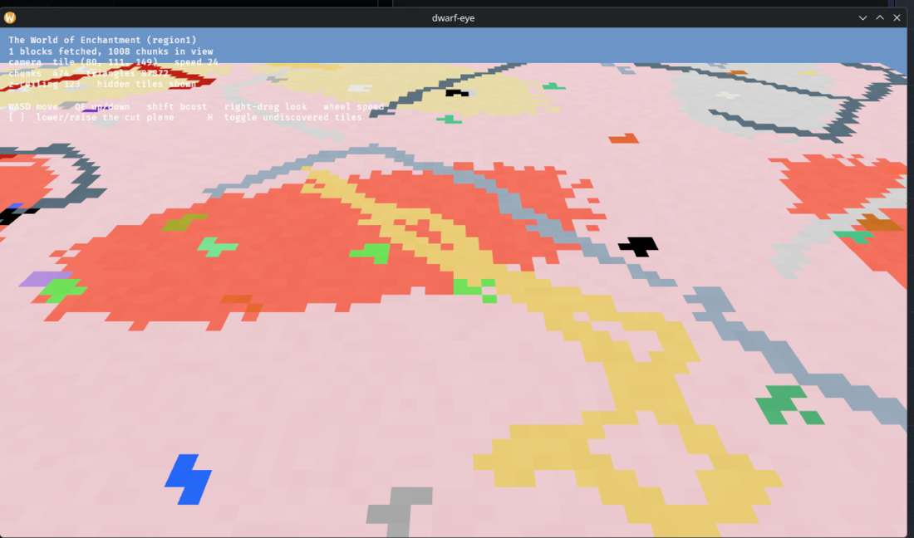
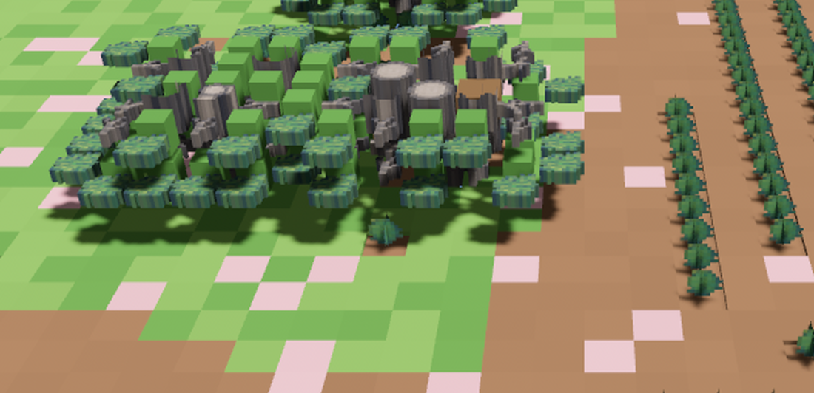
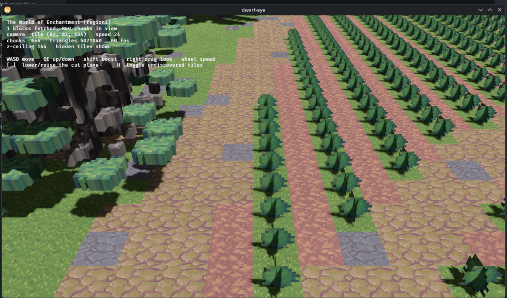

# dwarf-eye

A Minecraft-style voxel view of a **live** Dwarf Fortress map, fed by DFHack's
RemoteFortressReader plugin.

[Architecture](docs/architecture/README.md) · [Gallery](docs/gallery/README.md)



## Requirements

Dwarf Fortress with DFHack (the Steam build ships it). Verified against DF
53.16 / DFHack 53.16-r1.1 / RemoteFortressReader 0.21.0.

DFHack's remote server listens on `127.0.0.1:5000` out of the box. The
`allow_remote` flag in `dfhack-config/remote-server.json` only chooses the bind
address, so a local client needs no configuration.

## Running

Start Dwarf Fortress, load a fort or an adventurer, then:

```sh
make run                      # or: cargo run --release -p dwarf-eye
make run CLOUDS=cumulus=0.6   # with a forced sky
make lab                      # the tree generator bench, no game needed
make shot                     # screenshot of the viewer into shots/
make showcase                 # shoot the scene list into docs/gallery/
make budget                   # where the triangles go
make test                     # unit tests
```

| Key | |
|---|---|
| `Tab` | free flight or walk sync |
| `WASD` | move |
| `Q` / `E` | down / up (on stairs, in walk sync) |
| `Shift` | 4x speed |
| right-drag | look |
| wheel | move speed |
| `[` `]` | lower / raise the cut plane |
| `H` | show or hide undiscovered tiles |
| `,` `.` | step the game clock an hour (six with shift) |
| `1` `2` `3` | weather: clear / rain / snow |

`DWARF_EYE_Z_OFFSET` moves the starting cut plane relative to the player
(default +16, high enough to clear a tree canopy); `-8` starts it below ground,
for looking straight into the rock. `DWARF_EYE_CAM` scales how far back the
camera starts and `DWARF_EYE_VIEW=yaw,pitch` (degrees) aims it.

### Walk sync

`Tab` hands the camera to the adventurer. It stands in the character's tile at
eye height, `WASD` walks freely inside that one cell, and crossing a cell edge
asks Dwarf Fortress to step the character that way. The camera does not wait
for the answer — it walks on into the next cell, and the position poll settles
up: a confirmed step needs nothing, a step the game will not take springs the
camera back and shuts that edge for a couple of seconds. It is never more than
one cell ahead of the game, so a second edge waits for the first step to land.
Ramps carry the eye up and down on their own; stairs take `Q` and `E`.

The sync runs both ways. Move the character in the game — click a far tile,
travel, get shoved — and the camera follows the tile it finds itself in,
keeping your place in the cell and where you were looking.

Walk mode holds its own DFHack connection on its own thread, because a step has
to be confirmed in a fraction of a second and one map collection pass can take
many. `DWARF_EYE_WALK=1` starts in walk sync, and
`DWARF_EYE_WALK_DRIVE=bearing,seconds;…` walks a scripted route — compass
degrees, 0 north, 90 east, an empty bearing to stand still — for testing the
mode with no hand on the keyboard.

`F12` saves a screenshot in the working directory.
`DWARF_EYE_SHOT=path[:seconds]` saves one after the delay and exits, for
checking a build without sitting at the window.



## Layout

| Crate | |
|---|---|
| `dfhack-remote` | the DFHack RPC protocol: handshake, method binding, generated protobuf types |
| `dwarf-eye-art` | reads DF's own sprite sheets and the raws that index them |
| `dwarf-eye-world` | decodes map blocks into voxels and meshes them; no engine dependency |
| `dwarf-eye` | the Bevy renderer |

The DFHack connection runs on its own thread and owns the world, because face
culling needs neighbouring chunks and meshing next to the data beats shipping
the data across. The render thread only uploads finished vertex buffers.

### Protocol notes

Both headers are raw C structs, so byte layout matters:

- Handshake: 12 bytes — `DFHack?\n` then a little-endian `i32` version of 1.
  The server answers `DFHack!\n` and its version.
- Message header: 8 bytes — `i16` id, **two bytes of struct padding**, `i32` size.
- Method id 0 is `BindMethod`; every other id is negotiated by name.
- A `RPC_REPLY_FAIL` header carries the error code in the size field and has no
  payload.

`BlockRequest` bounds are in 16-tile **blocks** for x/y and z-levels for z, but
`MapBlock.map_x`/`map_y` come back in **tiles**.

`.proto` files under `crates/dfhack-remote/proto/` are vendored from DFHack at
tag `53.16-r1.1`.

### Sprites as voxels



A DF tile sprite is drawn looking straight down, so its opaque region is a
horizontal cross-section of whatever fills the tile. `TREE_TRUNK_PILLAR` is a
disc, so extruding its alpha mask gives a round trunk — the shape is already in
the art, and nothing has to be modelled.

Four treatments, chosen from `TiletypeShape`:

| Mode | Tiles | Geometry |
|---|---|---|
| Extrude | trunks, cap walls | full-height mask |
| Thin extrude | branches, twigs | a slab through the middle |
| Billboard | saplings, shrubs, boulders | two crossed vertical planes |
| Flat tile | floors, pebbles | a textured slab from the atlas |

Caps come from vertical continuity: a trunk with more trunk above it has no
visible top, so that face is skipped. Models are cached per tiletype, species
and cap pair, then stamped into the chunk mesh.

`DWARF_EYE_GRID` sets sub-voxels per tile edge (default 12, range 4–32).

Resolving a tile to a sprite closes a four-link chain:

```
DFHack tiletype  TreeTrunkPillar + direction "--------"
material index   419:203  ->  plant raw WILLOW
graphics raw     [PLANT_GRAPHICS:WILLOW]
                 [TREE_TILE:TREE_TRUNK_PILLAR:TREE_WILLOW:11:12]
tile page        [TILE_PAGE:TREE_WILLOW] images/tree_willow.png, 32x32
```

Only 20 of 72 tree species ship their own sheet; the rest fall back to the
generic `TILE_GRAPHICS` table, which spells absent connections in lowercase
(`TREE_TRUNK_S_nwe` is the same tile as `TREE_TRUNK_S`).

DFHack's tiletype names and the raws' family names drifted apart, so
`library.rs` carries an alias table: DFHack says `TreeBranches`, the raws say
`TREE_BRANCH`; roots resolve to the environment sheet's `ROOT_WALL`. Families
such as `ROOT_WALL` ship only directional variants, so a lookup that matches
neither the tile's connections nor an undirected entry falls through to the
closest variant by direction bits.

`cargo run --release -p dwarf-eye-world --example coverage` reports which tiles
in view get a sprite and which fall back to plain blocks.

### Ground



Floors take a different path from trees. A floor sprite is a picture, not a
cross-section, and voxelising it destroys the detail that made it worth using —
a 32x32 texture downsampled to a 12x12 grid costs about three hundred triangles
per tile and looks flat. Ground is packed into a texture atlas and drawn as one
quad instead: twelve triangles, full resolution.

Both share the atlas. Voxel geometry points at a white cell and keeps its vertex
colour, so there is one material and one mesh per chunk.

Three things about the environment sheets are not obvious:

- **The numbered families are not variants.** `GRASS_1` through `GRASS_9` are the
  nine slices of one interlocking 3x3 edge pattern, and only the centre (`_5`)
  is fully opaque — the rest run 0-13%. DF picks a slice per tile from its
  neighbours so grass interlocks. A voxel view wants the centre everywhere.
  The centre's own variants (`_5`, `_5B`, `_5C`, `_5D`) line up with DFHack's
  four floor variants, so the variety survives.
- **Some sprites are colours, others are patterns.** Grass is drawn green;
  stone, soil and pebbles are near-grey and meant to be tinted by the material.
  `Sprite::saturation` decides which without a hand table. Material colours are
  then damped toward their own brightness, because DF's `state_color` is far more
  saturated than DF's rendering of it — rock salt is `[255, 192, 203]`, and a
  floor of it in-game reads as grey stone, not pink.
- **A shrub owns its whole tile.** DFHack reports no floor under a shrub,
  sapling or boulder, so each one has ground synthesised beneath it from its
  material class. Without that, every crop row is a hole with sky behind it.

### Sky

The sun follows Dwarf Fortress's own clock. DF runs 1200 ticks to a day, 28 days
to a month, 12 months to a year, and `cur_year_tick` is the only clock it
exposes — dawn puts the sun due east, noon overhead, dusk due west, with the
year's swing giving winter light its low angle.

Sky colour comes from Bevy's Bruneton atmosphere (Rayleigh and Mie scattering),
raymarched rather than sampled from lookup textures. The sun is a real
32-arcminute disk, and the same sky lights the scene through an environment map,
which is what makes shade under a tree read as sky-blue rather than black.
Light shafts are a fullscreen pass of our own (`god_rays.rs`), lit by the shadow
cascades and the baked cloud shadow map, with density driven by the weather.

Stars are one mesh of unlit quads on a sphere, spun by the clock and faded by
the sun's elevation. They sit at 20000 units, beyond the horizon mesh and inside
the camera's far plane; nearer than the terrain they show through distant hills.
Unlit means their colour comes from `base_color` and the vertex attribute alone.
The lit path's `emissive` is never read, which also keeps them clear of the
exposure, so they hold steady while the scene's own stop opens.

Night is a second directional light on the far side of the sun's arc, dim and
cool, with no shadow cascades of its own. It lags the sun by the moon's phase,
which Dwarf Fortress's 28-day month supplies, so a full moon rises as the sun
sets. Under it sits a starlight ambient floor, and over both an exposure metered
off whichever light is up: the daylit scene keeps its stop exactly, and night
opens about five. The sun's own light fades out three degrees either side of the
horizon rather than switching off, so nothing is lit sideways by a set sun.

`DWARF_EYE_HOUR=22` (also `21:30` or `21.5`) pins the hour the view is lit at
and leaves the game's clock where the player left it, the way to look at night
without stepping the world. The date stays the game's own, so the season and the
moon's phase are real.

### Clouds

DF reports a cloud *kind* per world tile rather than a coverage number —
cumulus, stratus, cirrus and fog — and the kinds differ mostly in how they
occupy height. Each shapes a field of spherical puffs: cumulus fills a third of
the column but only patches of sky, stratus is a near-total sheet a fraction as
deep as it is broad, cirrus is thin and drawn out along the wind.

Those puffs feed two consumers, so the clouds you see and the shadows they throw
describe the same sky: the visible geometry, and a 3D density texture the
terrain shader marches toward the sun.

**Clouds are geometry, not volumetric fog.** Bevy's volumetric fog was the first
attempt and cannot work for cloud bodies — `volumetric_fog.wgsl` attenuates its
own ambient by Beer's law:

```wgsl
var accumulated_color = exp(-ray_length_view * (absorption + scattering))
    * ambient_color * ambient_intensity;
```

The thicker the cloud, the *less* fill light it gets, so cloud interiors render
black and no `ambient_intensity` rescues them. That plugin is for light shafts,
where the medium is thin.

`cloud.wgsl` shades the puffs instead, with the two things that make a cloud
read: light wrapping well past the terminator, and light bleeding through where
the cloud is thin (vertex red carries how deep in the body a point sits, green
how far up the cloud). It is a fragment-only `MaterialExtension` — a custom
vertex shader breaks the depth prepass, which fails with
`Location[7] ... is not provided by the previous stage outputs`.

Still cartoonish; the puff distribution wants more work.

**Cloud shadows.** Bevy's volumetric fog never shadows scene geometry, so
`cloud_shadow.wgsl` extends the terrain material to march the density volume
from each fragment toward the sun. Three things cost time:

- Material bindings live in bind group **3** in this version of Bevy, not 2 —
  group 2 is the mesh. Hardcoding 2 leaves the bindings out of the pipeline
  layout, and the shader fails validation with no other clue.
- The 3D density texture must always be bound. Leaving it `None` drops its
  binding from the layout with the identical failure.
- The march wraps horizontally rather than clipping at the deck's bounds.
  Clipping draws a straight box edge across the ground where the sun ray leaves
  the volume.

The deck holds a fixed altitude above the terrain. Following the camera
vertically puts the viewer inside it, and everything greys out.

`DWARF_EYE_CLOUDS=cumulus=0.8,cirrus=0.4` forces a sky for testing.
`DWARF_EYE_WIND=x,z` sets the wind in tiles per second, and
`DWARF_EYE_CLOUD_TUNE=sigma=0.10,detail=0.32,gain=3,ambient=1,haze=0.0006,cirrus=0.5,shadow=0.85,steps=72`
overrides the shading knobs. `DWARF_EYE_EV100` overrides the exposure.

### Beyond the live window

Dwarf Fortress holds a 144-tile window that follows the character, and DFHack
reports blocks relative to it. The session pins a render origin on connect and
converts every request and reply, so chunks keep their places as the character
walks. Every pass fetches the whole window, unforced, so only blocks whose hash
changed come back, in slabs of 500 blocks because DFHack refuses any reply over
64 MiB.

Chunks are cached on disk under `~/.cache/dwarf-eye/<world>-<save>/`
(`DWARF_EYE_CACHE` overrides the root), keyed by absolute position, and restored
on the next connect. A chunk the game sends again replaces the cached one.
Columns whose lowest cached chunk is sparse hold canopy with no ground under it
and are dropped on restore.

Crowns are drawn at two resolutions. Near the camera a tree is cut into four
voxels per tile with alpha-masked leaves, its plants and its hanging strands;
beyond that it is the same tree at one voxel per tile, on one opaque material,
with the undergrowth dropped. The swap happens where a near leaf voxel stops
covering two pixels, which depends on the window's height and the lens: about 7
blocks into a 720-tall window, 11 into a 1190-tall one. `DWARF_EYE_LOD_NEAR`
sets that distance in blocks, and `DWARF_EYE_OCCLUSION=0` turns off the GPU
occlusion culling the camera otherwise asks for.

Past the window, DFHack's region maps (one sample per 48 tiles for the world
tiles around the player) and the world map (one per 768, interpolated) become a
coarse heightfield out to the horizon. A block mask marks every block whose fine
chunks reach the ground, and the horizon material discards over marked blocks in
the main pass and the depth prepass, so the coarse ground never cuts through the
fine. `DWARF_EYE_HORIZON_TRANSPOSE` flips the region sample order for testing;
the default (y-major) is the verified one.

Full detail outside the window is not obtainable: DF discards the local map on
offload and regenerates it from region details, and no DFHack call reaches
tiles beyond `world.map.block_index`.

### Driving the world for testing

DFHack's `RunCommand` is method id 1 and needs no binding, which makes the whole
console reachable:

| | |
|---|---|
| `weather clear \| rain \| snow` | sets the weather; bare `weather` prints a 5x5 map |
| `lua <expr>` | evaluates Lua, so `df.global.cur_year_tick` is readable and writable |

In the viewer, `,` and `.` step the game clock by an hour (six with shift), and
`1` `2` `3` set the weather.

`GetWorldMap` returns a `Cloud` per world tile — 16641 of them on a 129x129
world — each carrying front, cumulus, cirrus, stratus and fog. Nothing reads
them yet.

### Colour

DF's `state_color` describes a material as a substance, not as terrain: loam is
grey, grass plants are brown, willow is orange. `palette.rs` therefore takes
ground cover, liquids and wood from the tiletype's material *class*, and lets
stone, ore and constructions keep their own colour so granite still reads
differently from marble.

The pink is rock salt. That one is DF's own colour, and it is correct.

## Not done yet

- Walls still draw as flat-coloured blocks; only floors are textured.
- Units, buildings and items are fetched but not drawn.
- Fortifications draw as plain cubes.
- Water and magma get vertex alpha, but the material is opaque, so they render
  solid.
- Shrubs, saplings and dead trees are still crossed billboards; the tree crate
  will grow them (issue #1).
- Cached chunks far from the camera stay at full detail; a mid LOD is planned.
- The coarse horizon meets the fine map with a bare step (issue #9).
