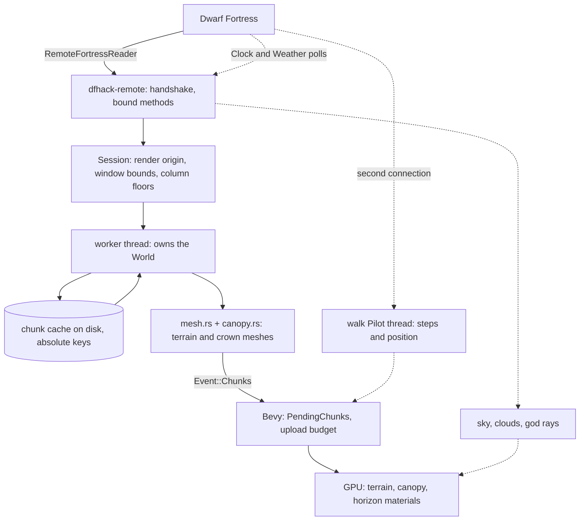

# dwarf-eye architecture

dwarf-eye is a sidecar to a running Dwarf Fortress game: a real-time 3D voxel
view of the live map, read over DFHack's RemoteFortressReader. The game stays
the source of truth for the world, the clock, the weather and the adventurer;
dwarf-eye renders it and, in walk mode, steps the adventurer through DFHack.
Rust, Bevy 0.19, GPL-3.0-or-later.

## Data flow

The heavy path is solid, the side channels dashed. Walk mode holds its own
DFHack connection because a step must be confirmed in a fraction of a second and
one map pass can take many; the clock and weather polls still share the worker
thread, which is issue #4.

## Pages

| Page | |
|---|---|
| [pipeline/](pipeline/README.md) | DFHack to Bevy: the thread, the passes, the meshes |
| [pipeline/protocol.md](pipeline/protocol.md) | the RPC client and the session's one-time fetches |
| [pipeline/coordinates.md](pipeline/coordinates.md) | absolute positions and the render origin |
| [pipeline/worker.md](pipeline/worker.md) | commands, events and one collection pass |
| [pipeline/cache.md](pipeline/cache.md) | the disk cache and the column floors |
| [pipeline/meshing.md](pipeline/meshing.md) | chunks to triangles, and which material carries what |
| [factory/](factory/README.md) | classify, resolve, treatment, and the overlay idea |
| [factory/plants.md](factory/plants.md) | the L-system replacement for a stock plant |
| [factory/prefabs.md](factory/prefabs.md) | voxel prefab instances for buildings |
| [factory/registering.md](factory/registering.md) | how a new override is registered |
| [textures/](textures/README.md) | DF's sprite sheets, the raws that index them |
| [textures/atlas.md](textures/atlas.md) | packing, padding, mipmaps, texel density |
| [textures/canopy.md](textures/canopy.md) | world-space leaf, bark and streamer surfaces |
| [textures/ramps.md](textures/ramps.md) | DF's ramp sheets on a neighbour-derived slope |
| [preload/](preload/README.md) | fetching and meshing ahead on the travel vector |
| [lod/](lod/README.md) | fine chunks, planned mid detail, coarse horizon |
| [lod/horizon.md](lod/horizon.md) | region and world maps, the block mask, the seam |
| [sky/](sky/README.md) | clock, sun, stars, clouds, weather |
| [sky/clock.md](sky/clock.md) | DF's calendar in both game modes |
| [sky/sun-and-stars.md](sky/sun-and-stars.md) | sun direction, atmosphere, star field |
| [sky/clouds.md](sky/clouds.md) | the cloud volume and its baked shadows |
| [sky/weather.md](sky/weather.md) | haze and god rays |
| [walk/](walk/README.md) | walk sync: connection, optimistic steps, reconciliation |
| [testing/](testing/README.md) | the four validation layers and what a change must include |

## How to read these

Every page carries a Status line: landed with commit or file references, in
flight with an issue number, or planned with an issue number. The code on main
is the ground truth. Existing notes,
[docs/dfhack-horizon-notes.md](../dfhack-horizon-notes.md),
[docs/vox-uristi-notes.md](../vox-uristi-notes.md) and the repo
[README](../../README.md), are claims to verify and link rather than copy; where
one disagrees with the code, the page says which is right.

`CLAUDE.md` carries the rule that these pages travel with every change.
