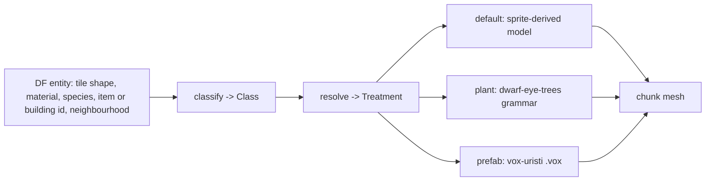

# The entity factory

Status: planned as a registry (issue #5); the first override, trees, is landed
(`crates/dwarf-eye-world/src/{tree.rs,canopy.rs}`, 62a35e4); the rest of the
plant work is in flight (issue #1).

## What it will do

Take DF's own entity stream, classify every tile, plant, item and building, and
resolve each class to a treatment. The default treatment is the faithful
sprite-derived geometry that already exists; an override replaces the look and
nothing else.

## The overlay idea

A stock DF entity keeps its DF extent. The game says where the thing is, how
tall it is and how far it reaches; the treatment decides what it looks like
inside that. Nothing an override draws leaves the space the fortress map gave
it, so the map still reads as the same map.

Trees are the worked example. DF contributes height, a radius cap, the species
and a seed; the grammar in `dwarf-eye-trees` supplies the shape
([plants.md](plants.md)).

## Pages

| Page | |
|---|---|
| [plants.md](plants.md) | the L-system replacement for a stock plant, and the seed rules |
| [prefabs.md](prefabs.md) | voxel prefab instances such as vox-uristi's `.vox` buildings |
| [registering.md](registering.md) | how a new override is registered |

## What exists today

Classification is scattered rather than registered. `library.rs:mode_for` maps a
`TiletypeShape` to one of five `RenderMode` values, `library.rs:canopy_part` and
`library.rs:is_trunk` mark tree tiles, and `mesh.rs:build_chunk_budgeted` early-outs
on those two before anything else. Issue #5 replaces the early-outs with registry
lookups.

| `RenderMode` | Tiles | Geometry |
|---|---|---|
| `Extrude` | trunks, cap walls | full-height mask |
| `ThinExtrude` | branches, twigs | a slab through the middle |
| `Billboard` | saplings, shrubs, boulders | two crossed vertical planes |
| `FlatTile` | floors, pebbles | a textured slab from the atlas |
| `Ramp` | ramps | a wedge from the ramp sheet |

## Claims to verify

The repo [README](../../../README.md) lists the flat tile treatment as "not
wired yet". The code is right and the README is stale: `library.rs:model` has
resolved `FlatTile` to an atlas cell since the ground atlas landed.

## Invariants

- Every override receives the entity's DF extent and stays inside it.
- Seeds come from absolute coordinates and species, never from render
  coordinates and never from the tile configuration around the entity.
- Classification also feeds the heightfield work, so a class has to say what a
  tile is, not only how to draw it.

## Related issues

#5 (the registry), #1 (shrubs, saplings, dead trees, streamers), #7 (ground
cover), #15 (units, items and buildings), #6 (heightfield needs the same
classification).
