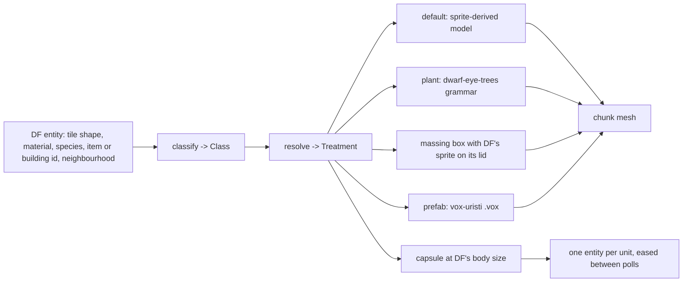

# The entity factory

Status: the registry is landed for vegetation
(`crates/dwarf-eye-world/src/factory.rs`); trees, shrubs, saplings, dead plants
and tufts route through it (issue #1). Units, buildings and item piles are
classified and drawn as placeholders (issue #15); the prefabs that replace
those placeholders are still to come (issue #5).

## What it does

Take DF's own entity stream, classify every tile, plant, item and building, and
resolve each class to a treatment. The default treatment is the faithful
sprite-derived geometry that already exists; an override replaces the look and
nothing else.



## The overlay idea

A stock DF entity keeps its DF extent. The game says where the thing is, how
tall it is and how far it reaches; the treatment decides what it looks like
inside that. Nothing an override draws leaves the space the fortress map gave
it, so the map still reads as the same map.

Trees are the worked example. DF contributes height, a radius cap, the species
and a seed; the grammar in `dwarf-eye-trees` supplies the shape
([plants.md](plants.md)).

## Pages

| Page | |
|---|---|
| [plants.md](plants.md) | the L-system replacement for a stock plant, and the seed rules |
| [prefabs.md](prefabs.md) | voxel prefab instances such as vox-uristi's `.vox` buildings |
| [registering.md](registering.md) | how a new override is registered |

## The registry

`factory.rs` is five calls and no state:

```
classify(Tile, Near) -> Class      // Tree, Shrub, Sapling, DeadTree, TallGrass, Boulder, Built, Other
classify_building(type) -> Class   // Building(type), from DF's own building_type
classify_unit() -> Class           // Unit
classify_items(count) -> Class     // ItemPile once enough of them share a tile
extent(Tile) -> Extent             // Tile or Tree: how much room DF gives it
footing(Tile, Class) -> Footing    // Ground, Slope, Cliff, Tile: what it does to the ground surface
resolve(Class, Style) -> Treatment // Sprite, Grown(...), Billboard, Massing(height), Capsule
plan(Tile, Near) -> Plan           // the three, decided once per tiletype
seed(x, y, z, species) -> u64      // absolute tile and species, nothing else
```

## What comes out of the tile stream, and what does not

Tiles are classified once per tiletype and cached; the other three are not
tiles at all and each has its own entry point.

| Class | Where it comes from | Treatment |
|---|---|---|
| `Building(type)` | `MapBlock.buildings`, stamped onto the tiles of its footprint (`world.rs:stamp_buildings`) | `Massing(h)` |
| `Unit` | `GetUnitList` on its own connection, four times a second (`units.rs`) | `Capsule` |
| `ItemPile` | `MapBlock.items`, once `PILE_ITEMS` of them share a tile | `Massing(0.22)` |

`Massing(h)` is a box of the entity's footprint, `h` of a z-level tall, in the
material's colour, wearing DF's own top-down sprite on its lid where the raws
name one. `mesh.rs:build_furnishings` draws it as a second pass over the chunk,
*on top of* whatever the tile itself drew: a building is a thing standing in a
tile, not a tile, and the floor under a door is still a floor. It is the
placeholder the `.vox` prefabs replace ([prefabs.md](prefabs.md)); the extent
is DF's, so a prefab dropping in changes the look and nothing else.

`BuildingKind` groups DF's fifty-five building types into the ten looks they
want, and decides the height: a door fills its tile, a hatch is a lid, a
workshop is a slab reading its own sprite. `BuildingKind::Zone` is a
designation rather than a thing — a stockpile, an activity zone, a road — and
draws nothing at all; it never even reaches a tile, because an activity zone
can cover a meadow and marking that as built work would stop a tree growing in
it.

`library.rs:pack_buildings` packs the lids into the same atlas the ground and
walls use, before the first frame: one cell per building type per material
sheet (`ITEM_DOOR_WOOD`, `ITEM_DOOR_STONE`), and one per square of a workshop's
footprint (`WORKSHOP_CARPENTER_0_1`). 294 cells of the 1024, on top of the 305
the ground, ramps and walls already took. `library.rs:building_cell` is the
lookup, falling through the sheets in `factory::sheet_order` so a wax door is a
wooden one rather than nothing.

A unit's capsule takes DF's own body size, scaled against an adult human, and
its colour from the creature raws where those decode and a stable hash per
creature index where they do not (see
[pipeline/protocol.md](../pipeline/protocol.md)). The adventurer — DF's
`follow_unit_id` — is lit from inside so it is findable in a crowd of
livestock. Positions are eased between polls, and a jump of more than a few
tiles is taken outright rather than slid through the ground.

`Tile` is what DF says about a tiletype: shape, material, special, DFHack's
name, and the species standing there. `Near` carries only what the tile cannot
say for itself — today, whether DF links it to a tree, which is what separates
a cap tile from masonry.

`TileLibrary::load` calls `plan` once per tiletype and keeps the answer, so a
mesher asking per tile pays one hash lookup.
`mesh.rs:build_chunk_budgeted` asks `Plan::grown`: what the factory grows is
skipped by the sprite path, and a one-tile plant keeps the ground slab the
billboard used to stand on. `Style::current` reads `DWARF_EYE_PLANTS=billboard`
once, which puts standing plants back on crossed sprites for comparison.

`Plan::footing` is the same decision for the ground: `Ground` and `Slope` are
the natural surface the heightfield draws as one sheet, `Cliff` is where that
sheet stops and holds its height, and `Tile` keeps the geometry the sprite
library gives it ([../pipeline/meshing.md](../pipeline/meshing.md)). Whether a
particular cliff has a ramp against it is the mesher's neighbourhood question,
not the factory's, which is why the answer can be cached per tiletype.

Sprite geometry is unchanged underneath: `library.rs:mode_for` still maps a
`TiletypeShape` to one of five `RenderMode` values for everything the factory
leaves alone.

Buildings, units and item piles never enter `mode_for`: they are not tiles, and
their geometry is the massing box and the capsule above.

| `RenderMode` | Tiles | Geometry |
|---|---|---|
| `Extrude` | trunks, cap walls | full-height mask |
| `ThinExtrude` | branches, twigs | a slab through the middle |
| `Billboard` | saplings, shrubs, boulders | two crossed vertical planes |
| `FlatTile` | floors, pebbles | a textured slab from the atlas |
| `Ramp` | ramps | a wedge from the ramp sheet |

## Claims to verify

The repo [README](../../../README.md) lists the flat tile treatment as "not
wired yet". The code is right and the README is stale: `library.rs:model` has
resolved `FlatTile` to an atlas cell since the ground atlas landed.

## Invariants

- Every override receives the entity's DF extent and stays inside it.
- Seeds come from absolute coordinates and species, never from render
  coordinates and never from the tile configuration around the entity.
- Classification also feeds the heightfield work, so a class has to say what a
  tile is, not only how to draw it.
- `Class::Built` is what someone raised: nothing vegetal is grown into it, and
  a crown's envelope is clipped by it (`tree.rs:Envelope::blocked`).
  `Class::Building(_)` counts the same way — `factory::built` covers both — so
  a tree beside a hall no longer grows through its roof.

## The treatment is a chain

Landed (issues #5, #10, #31). `resolve` answers with one treatment, which is
the head of a longer answer: `chain(Class, Style)` returns the whole list of
stages, each a builder and the projected size it holds down to.

```
Detail   Voxels{per_tile, cutout, undergrowth, strands} | Crown | Box
         | Billboard | Prefab | Surface | Quad | Baked
EdgeRule Projected | Reach{of_near, at_least} | Far | Unbuilt
Stage    { detail, edge }   edge(near) -> tiles   key() -> Detail   built() -> bool
Chain    { stages }  stages()  window()  instanced()
chain(class, style) -> Chain      water_chain() -> Chain
tree_chain() -> &'static Chain    edges(&[Stage], near) -> Vec<f32>
StageCache<K, V>  get/insert/contains/retain/iter/at, keyed (K, Detail)
```

`Stage::edge` is the only place a hand-off distance is computed.
`EdgeRule::Projected` is the near band's own rule applied to that stage's leaf
voxel — a voxel `DETAIL / per_tile` times as wide still covers the pixel floor
that many times further out — and `Reach` is for a stage with no voxel of its
own, or one something else sets a floor under. `Chain::window` is the run a
chunk mesher can build; `Chain::instanced` is the whole list, which is what the
horizon's scatter draws.

The chains, written out whole even where only the head has a builder — a stage
nobody can build yet carries `EdgeRule::Unbuilt` rather than an invented
distance, and consumers skip it:

| Class | Chain |
|---|---|
| `Tree`, `DeadTree` | 4 voxels cutout with the undergrowth, 3 and 2 voxels cutout with the strands, 1 voxel opaque, the canonical crown, its box |
| `Shrub`, `Sapling`, `TallGrass` | grown at 2 voxels, *billboard*, *nothing* |
| `Built`, `Building`, `ItemPile` | fine cubes, *prefab*, *footprint box*, *nothing* |
| water (`water_chain`) | the mesher's surface, *one flat tinted quad* |

`StageCache` is the per-(key, stage) mesh cache the chain implies. The key is
whatever varies inside a stage — a tree's origin tile for the window, where
every tree is its own, a preset and growth variant for the horizon, where six
canonical shapes serve thousands of instances — and the stage is `Stage::key`,
so a coarse cut never overwrites the fine one at the key they share.
`canopy.rs:Forest.trees` and `horizon/grown.rs` are both behind it.

Region tiles do not yet enter `classify` as a coarse source; the scatter maps a
region tile's tree materials onto a preset itself (`scatter.rs:preset_for`).

## Related issues

#5 (the registry), #1 (shrubs, saplings, dead trees, streamers), #7 (ground
cover), #15 (units, items and buildings), #6 (heightfield needs the same
classification).
