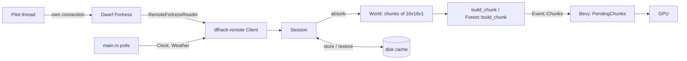

# Render pipeline

Status: landed (`crates/dwarf-eye-world/src/session.rs`, `crates/dwarf-eye/src/worker.rs`, `crates/dwarf-eye/src/main.rs`).

## What it does

Turns DFHack's map blocks into Bevy meshes, once per collection pass, without
ever blocking the render loop on a socket.

## How

One worker thread owns the connection and the decoded world
(`worker.rs:Bridge::spawn`). It receives `Command` values and answers with
`Event` values over two `std::sync::mpsc` channels. The Bevy app drains them in
`main.rs:drain_worker` and uploads a budget of meshes per frame in
`main.rs:upload_chunks`.

The heavy path and the light polls share one thread today, so a long pass
delays the clock. Splitting them is issue #4.

## Pages

| Page | |
|---|---|
| [protocol.md](protocol.md) | the DFHack RPC client and the session's one-time fetches |
| [coordinates.md](coordinates.md) | absolute positions, the render origin, the live window |
| [worker.md](worker.md) | the thread, its commands, and one collection pass |
| [cache.md](cache.md) | the on-disk chunk store and the column floors |
| [meshing.md](meshing.md) | chunks to triangles, and what rides which material |

## Invariants

- The worker thread owns the `World`. Face culling reads neighbouring chunks,
  so meshing happens next to the data and only vertex buffers cross the channel.
- A chunk dropped from the `World` does not come back on its own: an unforced
  `GetBlockList` returns only blocks whose hash changed
  (`session.rs:Session::fetch`).
- `Event::Chunks` with two empty meshes means despawn (`worker.rs:collect`).
- `MeshOptions` travels with every fetch and remesh, so the cut plane and the
  hidden-tile toggle are decided worker-side (`main.rs:ViewSettings::mesh_options`).

## Related issues

#4 (polls off the critical path), #10 (mid LOD), #16 (greedy meshing), #17
(closed, startup meshing cost), #23 (column floor re-probe).
