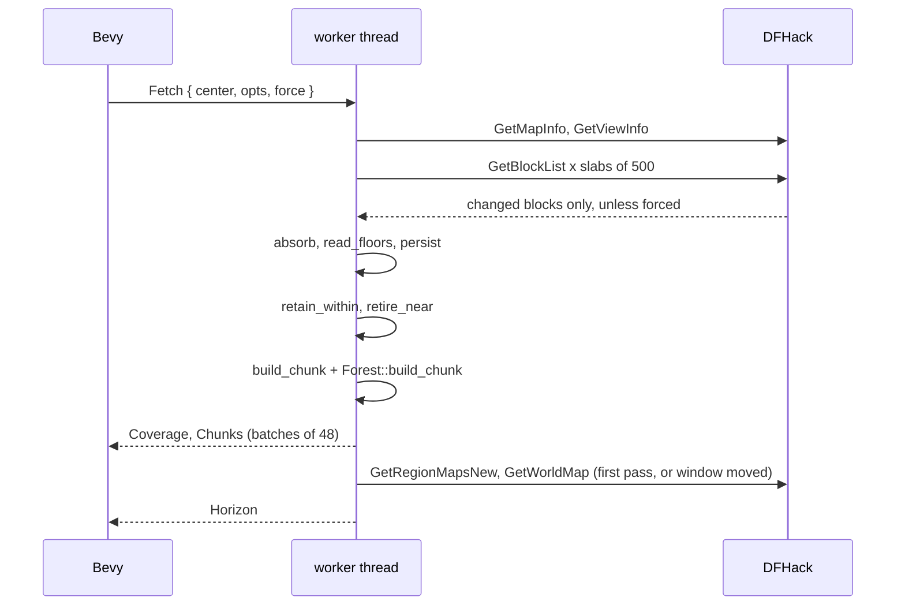

# The worker thread and one collection pass

Status: landed (`crates/dwarf-eye/src/worker.rs`); column floor re-probe in
flight (issue #23); poll split planned (issue #4).

## What it does

Runs the DFHack connection, the decoded world and the meshers on one background
thread, and streams finished geometry to the renderer.

## How

`Bridge::spawn` starts the thread and returns the channel pair plus the walk
mode `Pilot`. `worker.rs:run` connects, publishes the render origin, loads the
tile library, sends the atlas, restores the cache, then serves commands.

Commands are `Fetch`, `Remesh`, `Clock`, `Weather`, `Run` and `Shutdown`.
`worker.rs:collect` is the pass: refresh the window, read the view centre, tell
the session where the character is (`Session::watch_from`), fetch
`COLLECT_ABOVE` 200 levels up and `COLLECT_BELOW` 32 levels down, retire chunks
outside `RETAIN_RADIUS` 40 blocks horizontally, remesh what arrived and its six
neighbours (`worker.rs:remesh_touched`), and rebuild the horizon when the window
has moved.

`main.rs:request_blocks` drives it: on entering a new block, otherwise every
second flying and every 0.3 s walking. The first request forces.

## Invariants and gotchas

- Retention never clips vertically. The camera's height is not a reason to drop
  the crowns above it, and a dropped chunk needs a forced request to return.
- Blocks that arrived can lengthen a tree whose top was not yet visible, so
  `Forest::retire_near` forgets trees within one block and 20 levels of them.
- The pass is serial. A heavy first pass measured 16 to 21 s, and the clock poll
  queued behind it, which is issue #4.
- Meshes leave in batches of 48 and reach the GPU at `main.rs:UPLOAD_BUDGET` 24
  chunks a frame, nearest the camera first.
- Startup logs a depth histogram (`worker.rs:depth_histogram`), which is where
  the cost of fetching under the surface shows up.

## Related issues

#4 (a light connection for clock, weather and view centre), #21 (slab and
remesh order on the travel vector), #23 (re-probe under column floors), #17
(closed, restored-cache meshing cost).
