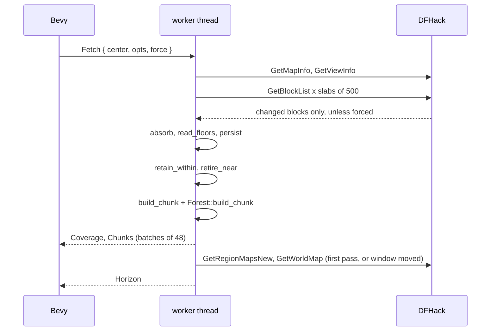

# The worker thread and one collection pass

Status: landed (`crates/dwarf-eye/src/worker.rs`); column floor re-probe in
flight (issue #23); clock and weather split onto their own connection
(`crates/dwarf-eye/src/polls.rs`, issue #4).

## What it does

Runs the DFHack connection, the decoded world and the meshers on one background
thread, and streams finished geometry to the renderer.

## How

`Bridge::spawn` starts the thread and returns the channel pair plus the walk
mode `Pilot`. `worker.rs:run` connects, publishes the render origin, loads the
tile library, sends the atlas, restores the cache, then serves commands.

Commands are `Fetch`, `Remesh`, `Run` and `Shutdown`. The clock and the sky
used to be two more and are now `polls.rs`, a light connection of their own.
`worker.rs:collect` is the pass: refresh the window, read the view centre, tell
the session where the character is (`Session::watch_from`), fetch
`COLLECT_ABOVE` 200 levels up and `COLLECT_BELOW` 32 levels down, retire chunks
outside `RETAIN_RADIUS` 40 blocks horizontally, remesh what arrived and its six
neighbours (`worker.rs:remesh_touched`), and rebuild the horizon when the window
has moved.

`main.rs:request_blocks` drives it: on entering a new block, otherwise every
second flying and every 0.3 s walking. The first request forces.

## What no longer waits on it

The clock and the weather are one-line Lua probes and they used to be commands
on this thread, which put both behind a slab of blocks: a heavy first pass held
the sun at midnight for the sixteen to twenty-one seconds it ran (issue #4).
`polls.rs` gives them a connection and a thread, sending the same `Event::Clock`
and `Event::Weather` down the same channel: the clock every second, the weather
every ten, refusals held off by a doubling back-off. `polls.rs:Schedule` is that
cadence and is tested on synthetic time.

One thing crosses back. Precipitation must not fall through a roof, and the
voxels that answer "is the sky open over the camera" are the worker's. So the
worker stores the answer for the pass's centre in a shared flag
(`polls::SkyOpen`, `worker.rs:open_sky`) and the weather poll reads it. A stale
flag costs one reading of rain under a ceiling.

The view centre is still read inside the pass: `collect` calls
`Session::view_center` and hands it to `Session::watch_from` before fetching,
because the pass needs it to place its own box. Moving it would mean shipping a
centre between threads for no gain, so it stays.

## Invariants and gotchas

- Retention never clips vertically. The camera's height is not a reason to drop
  the crowns above it, and a dropped chunk needs a forced request to return.
- Blocks that arrived can lengthen a tree whose top was not yet visible, so
  `Forest::retire_near` forgets trees within one block and 20 levels of them.
- The pass is serial, and everything it does still waits its turn. What used to
  wait with it and no longer does is the clock and the weather; measured on a
  5.5 s pass, the weather cadence now runs straight across it (10.03 s between
  readings) where it used to slip by the whole length of the pass.
- Meshes leave in batches of 48 and reach the GPU at `main.rs:UPLOAD_BUDGET` 24
  chunks a frame, nearest the camera first.
- Startup logs a depth histogram (`worker.rs:depth_histogram`), which is where
  the cost of fetching under the surface shows up.

## Related issues

#4 (landed for the clock and the weather; the view centre stays in the pass), #21 (slab and
remesh order on the travel vector), #23 (re-probe under column floors), #17
(closed, restored-cache meshing cost).
