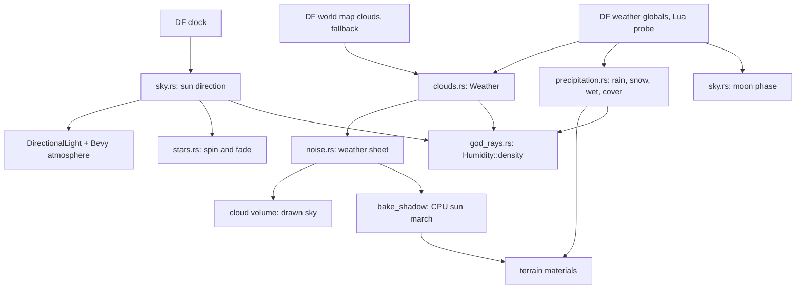

# Sky, weather and atmosphere

Status: landed (`crates/dwarf-eye/src/{sky.rs,stars.rs,clouds.rs,shadow.rs,god_rays.rs,noise.rs,precipitation.rs}`,
`crates/dwarf-eye-world/src/weather.rs`); night lighting in flight (issue #14);
the rest of the weather inventory in flight (issue #32); the haze model
landed, its two region inputs still to be carried by the worker (issue #18).

## What it does

Lights the scene from Dwarf Fortress's own clock and weather: sun position from
the calendar, sky colour from a physical atmosphere, clouds that both draw and
shadow, and shafts of light through haze.

## How

The game is the authority. `main.rs:poll_clock` asks twice a second and
`main.rs:poll_weather` every twelve seconds; both answers arrive as events and
land in the `Clock` and `Weather` resources.

## Pages

| Page | |
|---|---|
| [clock.md](clock.md) | DF's calendar, fortress and adventure counters |
| [sun-and-stars.md](sun-and-stars.md) | sun direction, atmosphere, star field, night |
| [clouds.md](clouds.md) | the cloud volume and its baked shadows |
| [weather.md](weather.md) | the weather probe, precipitation, snow, wet ground, the humidity model and god rays |

## Invariants and gotchas

- A black view with the HUD at 00:00 is the game at midnight, not a lighting
  bug. Step the clock with `,` and `.` or the `settime` probe.
- Sky colour comes from Bevy's raymarched Bruneton atmosphere, and the same sky
  lights the scene through `AtmosphereEnvironmentMapLight` at intensity 2.6.
  That environment light is what makes shade under a tree read blue.
- There is no moon and no emissive materials, so night is black beyond the
  environment light and the stars. Issue #14.
- Exposure is `ev100` 13.0 by default because `RAW_SUNLIGHT` is pre-scattering;
  `DWARF_EYE_EV100` overrides it.
- Env overrides win permanently: with `DWARF_EYE_CLOUDS` or `DWARF_EYE_WEATHER`
  set, the sky DF reports never lands (`main.rs:drain_worker`).

## Related issues

#14 (night lighting and emissives), #32 (the weather inventory), #18 (region
rainfall and temperature onto `WeatherReport`), #4 (the clock poll queues behind
a heavy map pass), #19 (closed, adventure-mode clock).
