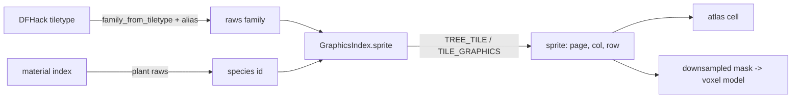

# Textures

Status: landed (`crates/dwarf-eye-art/src/{lib.rs,raws.rs,atlas.rs}`,
`crates/dwarf-eye-world/src/library.rs`, `crates/dwarf-eye/src/texture.rs`).

## What it does

Reads Dwarf Fortress's own sprite sheets and the raws that index them, and turns
them into one atlas the whole map samples, plus procedural surfaces for
vegetation.

## How

`dwarf-eye-art:find_install` locates the game, honouring `DF_DIR` first and then
the usual Steam paths. `Art::load` walks `data/vanilla/*/graphics/` and
`raws.rs:GraphicsIndex::load_dir` reads every `.txt`, `tile_page*` files first
so a page exists before an entry points at it.

Resolution order in `raws.rs:GraphicsIndex::sprite`: the species at the exact
direction mask, the species undirected, the generic table at that mask, the
generic table undirected, then the nearest entry by direction bits
(`raws.rs:nearest`, ties broken on the lowest mask so the choice is the same
every run).

## Pages

| Page | |
|---|---|
| [atlas.md](atlas.md) | packing, padding, mipmaps, texel density |
| [canopy.md](canopy.md) | procedural leaf, bark and streamer surfaces in world space |
| [ramps.md](ramps.md) | DF's ramp sheets and how a slope wears one |
| [walls.md](walls.md) | the environment wall sheets, the neighbour variants, and the derived side face |

## Invariants and gotchas

- Only 20 of 72 tree species ship their own sheet; the rest fall to the generic
  `TILE_GRAPHICS` table, which spells absent connections in lowercase, so
  `TREE_TRUNK_S_nwe` is the same tile as `TREE_TRUNK_S` (`raws.rs:parse_part`).
- DFHack's tiletype names and the raws' family names drifted, so
  `library.rs:alias` maps `TREE_BRANCHES` to `TREE_BRANCH` and `TREE_ROOTS` to
  the environment sheet's `ROOT_WALL`.
- `TREE_TILE` writes the part first and `TILE_GRAPHICS` writes it last. Reading
  them the same way round produces an empty index with no error.
- Numbered ground families are not variants. `GRASS_1` to `GRASS_9` are the
  nine slices of one interlocking 3x3 edge pattern and only the centre `_5` is
  fully opaque, so `library.rs:ground_alias` asks for the centre everywhere and
  maps DFHack's four floor variants onto `_5`, `_5B`, `_5C`, `_5D`.
- A built floor has no ground family at all. DFHack calls it `ConstructedFloor`,
  with four `ShoddyConstructedFloor` cuts and sixteen `ConstructedFloorTrack`
  variants beside it, and the raws name nothing of the sort, so
  `library.rs:construction_floor` sends every one of them to
  `floor_stone_blocks.png` — one atlas cell, shared, because the block sheet has
  no directional cuts — and `mesh.rs:strip_foot` skirts the slab with the foot of
  the constructed wall's own side strip ([walls.md](walls.md)). Nothing says what
  the thing was built from: the block, log, bar or boulder lives in the block's
  `construction_items` list, and a voxel carries a material index without the
  type that separates a plank from a slab, so a wooden roof comes out as blocks
  in wood colour. `WOOD_FLOOR`, `METAL_FLOOR` and the three `GLASS_*_FLOOR`
  sheets wait for the day a voxel carries the type as well.
- A sprite below `library.rs:PATTERN_SATURATION` 0.22 is a pattern to tint with
  the tile's material colour; above it, the sprite carries its own colour
  (`dwarf-eye-art:Sprite::saturation`).
- Ground sprites are flattened by cutting alpha at half opacity; wall sprites
  are blended, because DF's wall art is a four-level dither and the alpha
  channel carries as much of the rock as the colour does ([walls.md](walls.md)).
- No DF install means no sprites, not a failure: the worker reports it and the
  map draws as plain blocks (`worker.rs:run`).
- `cargo run --release -p dwarf-eye-world --example coverage` reports which
  tiles in view get a sprite.

## Related issues

#3 (ramp sheets and skirts), #7 (ground cover), #26 (a texture library of our
own on the same grey-base-plus-tint rule), #13 (closed, walls).
