# Gallery

Every frame here is the renderer against a live Dwarf Fortress, shot by
`make showcase` from the list in `tools/showcase/scenes.toml`. Nothing is
posed by hand: each scene is a set of environment knobs and a camera aim.

| World | The Dimension of Griffons (region2) |
|---|---|
| Game date | 15 Granite of 100 |
| Commit | `b425ba2` |
| Shot | 2026-09-08 |

The game's own clock and weather are never touched. `DWARF_EYE_HOUR` pins
the hour the view is lit at, `DWARF_EYE_CLOUDS` and `DWARF_EYE_WEATHER` the
sky, and every shot runs against a private cache so the user's own viewer
keeps its chunks.

## The knobs

Every one of these is read from the environment, so any frame below can be
reproduced without a rebuild.

### Framing and capture

| | |
|---|---|
| `DWARF_EYE_SHOT=path[:seconds]` | save one screenshot after the delay, then exit |
| `DWARF_EYE_VIEW=yaw,pitch` | aim the camera in degrees; yaw 0 looks north, pitch is negative downward |
| `DWARF_EYE_CAM=n` | scale how far back and above the player the camera starts |
| `DWARF_EYE_HUD=off` | leave the overlay out of the picture |
| `DWARF_EYE_Z_OFFSET=n` | start a cut plane n levels from the player; negative looks into the rock |
| `DWARF_EYE_WALK=1` | start in walk sync, standing in the character's tile |
| `DWARF_EYE_WALK_DRIVE=bearing,seconds;…` | walk a scripted route — compass degrees, 0 north, an empty bearing to stand still |

### Sky, light and weather

| | |
|---|---|
| `DWARF_EYE_HOUR=hh[:mm]` | pin the hour the view is lit at; the game's clock stays where the player left it |
| `DWARF_EYE_CLOUDS=cumulus=0.5,fog=0.4` | force a sky by kind: `cumulus`, `stratus`, `cirrus`, `fog` |
| `DWARF_EYE_WEATHER=clear\|rain\|snow` | the three skies the `1` `2` `3` keys ask the game for, without asking the game |
| `DWARF_EYE_GODRAYS=density=..,strength=..,g=..,dim=..,steps=..\|off` | override the light shafts |
| `DWARF_EYE_WIND=x,z` | wind in tiles per second |
| `DWARF_EYE_CLOUD_TUNE=sigma=..,detail=..,gain=..,ambient=..,haze=..,cirrus=..,shadow=..,steps=..` | the cloud shading knobs |
| `DWARF_EYE_EV100=n` | pin the exposure |
| `DWARF_EYE_CANOPY_SKY=n` | how much of the sky's fill a crown keeps |
| `DWARF_EYE_LEAF_LIGHT=n` | how much light a leaf passes from behind |

### Geometry and texture

| | |
|---|---|
| `DWARF_EYE_PLANTS=billboard` | put standing plants back on crossed sprites |
| `DWARF_EYE_PLANT_VOXELS=n` | sub-voxels per plant tile edge (default 2) |
| `DWARF_EYE_GRID=n` | sub-voxels per tile edge for sprite geometry (default 12, 4–32) |
| `DWARF_EYE_TEXELS=n` | texture density per tile |
| `DWARF_EYE_NO_MIPS=1` | the bare nearest-sampled atlas, for comparison |
| `DWARF_EYE_HORIZON_TRANSPOSE=1` | flip the region sample order, for testing |
| `DWARF_EYE_TREE_LOG=1` | log every tree grown |

### Data

| | |
|---|---|
| `DWARF_EYE_CACHE=dir` | the chunk cache root (otherwise `$XDG_CACHE_HOME/dwarf-eye`) |
| `DWARF_EYE_LIVE=1` | let the live walk test run; it **moves the adventurer** |
| `DWARF_EYE_SETTLE=n` | seconds that test waits for the map before setting off |

## Light through the day

The sun follows Dwarf Fortress's own clock. `DWARF_EYE_HOUR` pins the hour the view is lit at and leaves the game's clock where the player left it.

### Morning, clear

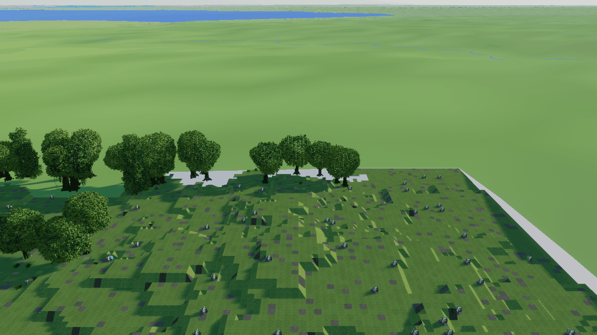

Half past seven, no cloud. The low sun rakes across the canopy and every crown throws its own shadow west.

```sh
DWARF_EYE_HOUR=07:30 DWARF_EYE_WEATHER=clear DWARF_EYE_VIEW=0,-22 DWARF_EYE_CAM=2 DWARF_EYE_HUD=off DWARF_EYE_SHOT=morning-clear.png:25 ./target/release/dwarf-eye
```

### Low sun, fog, light shafts

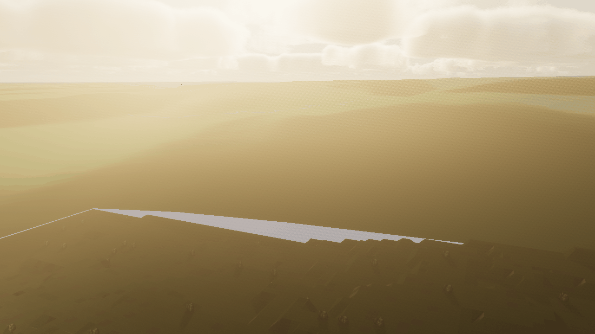

Seven in the morning with fog on the ground and cumulus above it. The shafts are a fullscreen pass lit by the shadow cascades and the baked cloud shadow, thickened by the fog.

```sh
DWARF_EYE_HOUR=07:00 DWARF_EYE_CLOUDS=cumulus=0.5,fog=0.4 DWARF_EYE_GODRAYS=density=0.02,strength=0.9 DWARF_EYE_VIEW=-65,-12 DWARF_EYE_CAM=1.2 DWARF_EYE_HUD=off DWARF_EYE_SHOT=godrays-fog.png:25 ./target/release/dwarf-eye
```

### Dawn

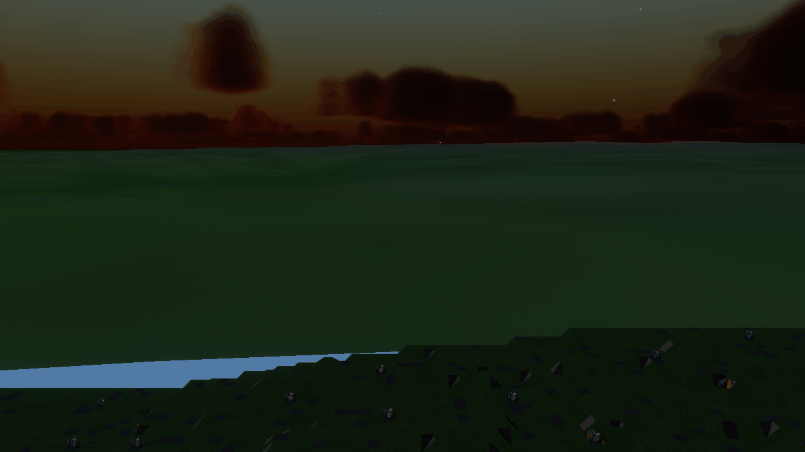

Ten to six, the sun still under the horizon due east. The atmosphere is raymarched Rayleigh and Mie scattering, so the dawn colour is the sky's own, not a gradient.

```sh
DWARF_EYE_HOUR=05:50 DWARF_EYE_VIEW=-90,-8 DWARF_EYE_CAM=1.2 DWARF_EYE_HUD=off DWARF_EYE_SHOT=dawn-crossing.png:25 ./target/release/dwarf-eye
```

### Night, by the moon

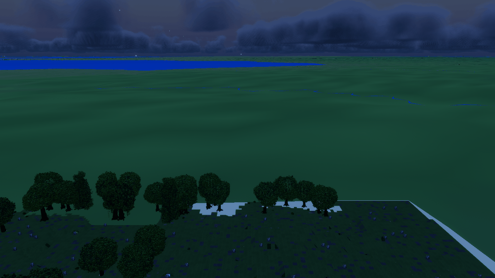

Midnight. A second directional light lags the sun by the moon's phase, over a starlight ambient floor, with the exposure metered off whichever light is up.

```sh
DWARF_EYE_HOUR=00:00 DWARF_EYE_VIEW=0,-14 DWARF_EYE_CAM=2.5 DWARF_EYE_HUD=off DWARF_EYE_SHOT=night-moon.png:25 ./target/release/dwarf-eye
```

## Weather

DF reports a cloud kind per world tile. The same field is drawn as geometry and marched for shadows, so the sky and the shade on the ground describe one sky.

### Noon under cumulus

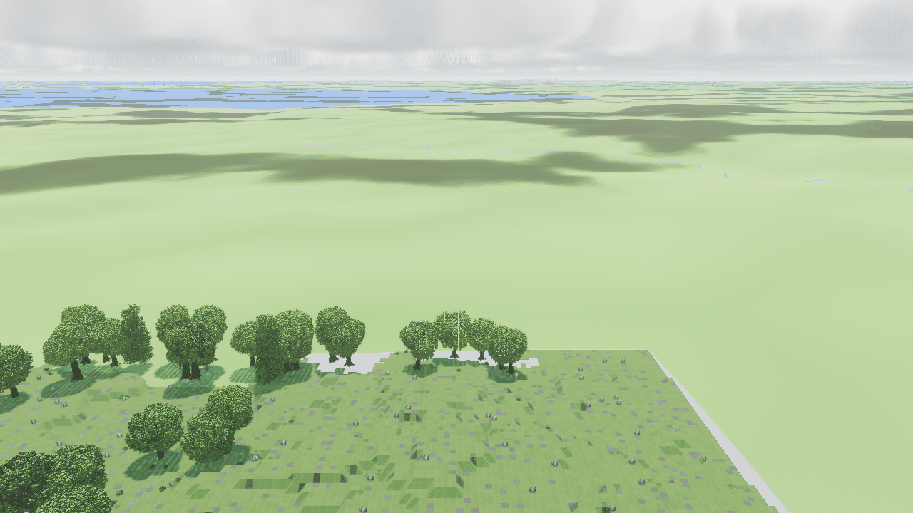

Midday with the sun overhead and a half-covered sky. The cloud shadows on the land are marched from the same density volume the puffs are drawn from.

```sh
DWARF_EYE_HOUR=12:00 DWARF_EYE_CLOUDS=cumulus=0.55 DWARF_EYE_VIEW=0,-16 DWARF_EYE_CAM=3 DWARF_EYE_HUD=off DWARF_EYE_SHOT=noon-cumulus.png:25 ./target/release/dwarf-eye
```

### The rain sky

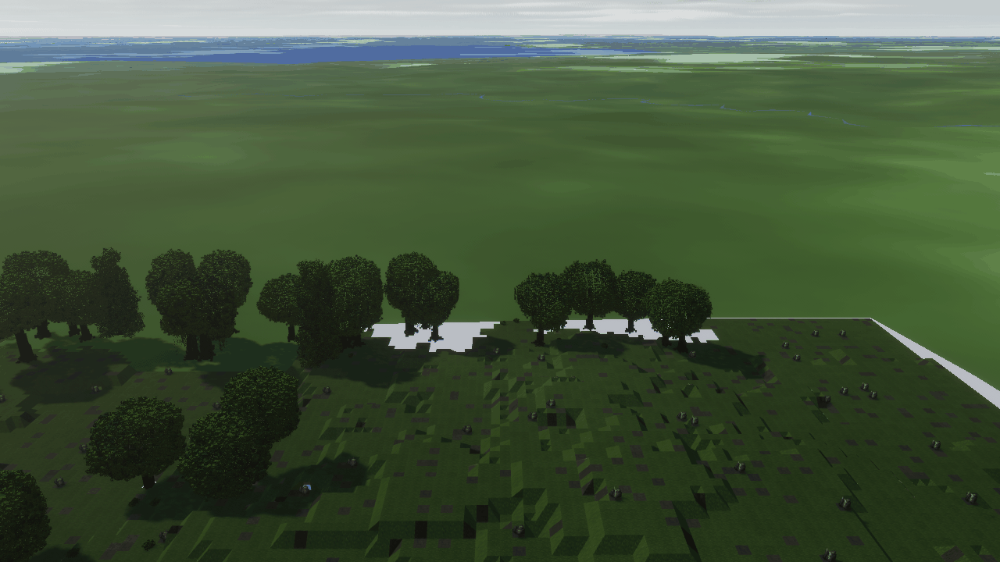

What the `2` key asks the game for, held viewer-side instead: near-total stratus with cumulus under it and a little fog. No drops fall — dwarf-eye draws no precipitation yet, so weather reaches the picture as cloud, light and shade.

```sh
DWARF_EYE_WEATHER=rain DWARF_EYE_HOUR=15:00 DWARF_EYE_VIEW=0,-20 DWARF_EYE_CAM=2 DWARF_EYE_HUD=off DWARF_EYE_SHOT=rain.png:25 ./target/release/dwarf-eye
```

### The snow sky

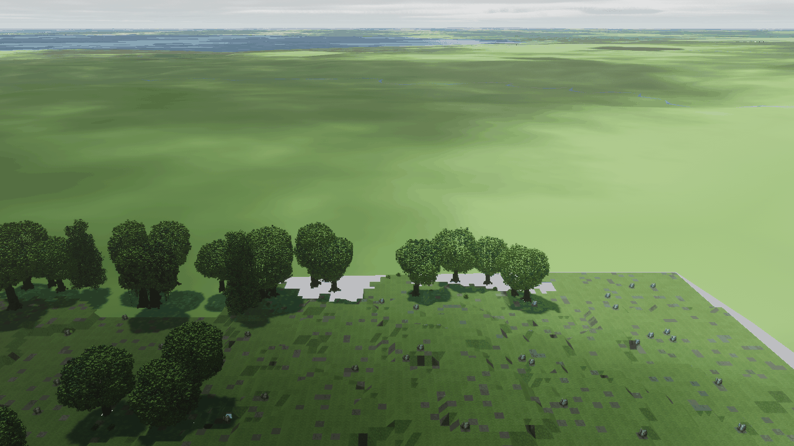

The `3` key's sky, also viewer-side: a thinner sheet with fog sitting on the ground under it. The ground stays as the game reports it — the sky is the viewer's, the snow would be the game's.

```sh
DWARF_EYE_WEATHER=snow DWARF_EYE_HOUR=13:00 DWARF_EYE_VIEW=0,-20 DWARF_EYE_CAM=2 DWARF_EYE_HUD=off DWARF_EYE_SHOT=snow.png:25 ./target/release/dwarf-eye
```

## Vegetation

Trees and plants are grown from DF's bounds, not modelled: seeds come from absolute coordinates plus species.

### The wood at crown height

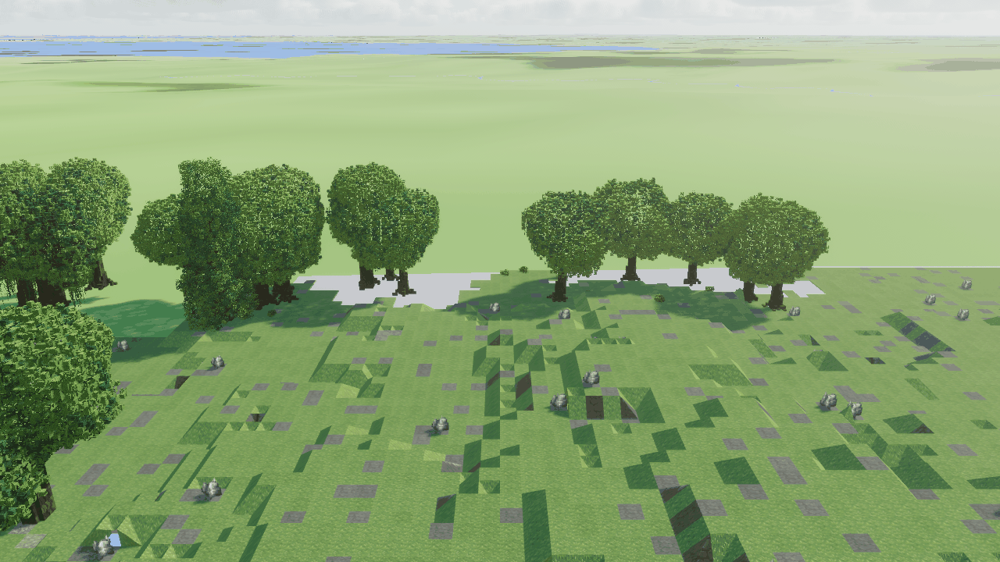

Crowns from just above them. Leaves are cutout geometry lit with the sky's fill weighted toward the faces that look up, which is what leaves a crown with a lit side and a shaded one; every tree is grown from its own coordinates, so no two repeat.

```sh
DWARF_EYE_HOUR=09:00 DWARF_EYE_VIEW=0,-20 DWARF_EYE_CAM=1 DWARF_EYE_HUD=off DWARF_EYE_SHOT=canopy-closeup.png:25 ./target/release/dwarf-eye
```

### Trees, shrubs and stone

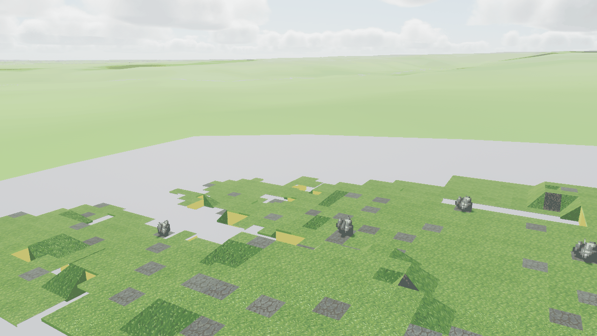

The vegetation layer close to. Crowns are grown rather than modelled — DF gives only the bounds, and the seed is the tree's own coordinates plus its species, so no two repeat — shrubs stand as voxels instead of crossed billboards, and trunks are extruded from their sprites, which are cross-sections and so come out round. `DWARF_EYE_PLANTS=billboard` puts standing plants back on sprites.

```sh
DWARF_EYE_HOUR=10:00 DWARF_EYE_VIEW=300,-15 DWARF_EYE_CAM=0.5 DWARF_EYE_HUD=off DWARF_EYE_SHOT=shrub-meadow.png:25 ./target/release/dwarf-eye
```

## Terrain

Floors are textured from DF's own sprite sheets and drawn as quads; walls, ramps and water come out of the voxel mesher. What stands in frame is whatever the character is standing next to — the map is live.

### Ground level

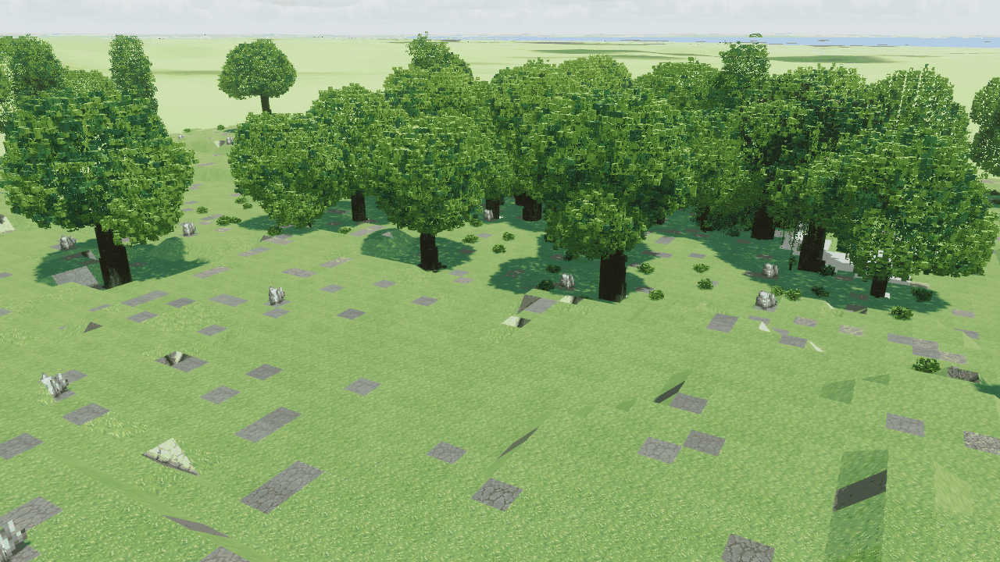

The ground beside the character at eye height. A floor is one textured quad a tile — the atlas, at full resolution, not a voxel grid — with the canopy's shadow falling across it; boulders and shrubs standing on it are voxels grown from the same sprite sheets.

```sh
DWARF_EYE_HOUR=11:00 DWARF_EYE_VIEW=120,-20 DWARF_EYE_CAM=0.4 DWARF_EYE_HUD=off DWARF_EYE_SHOT=ramps-pool.png:25 ./target/release/dwarf-eye
```

## Horizon

Past the 144-tile live window there is no fine detail to be had, so region and world maps become a coarse heightfield out to the skyline.

### The horizon from height

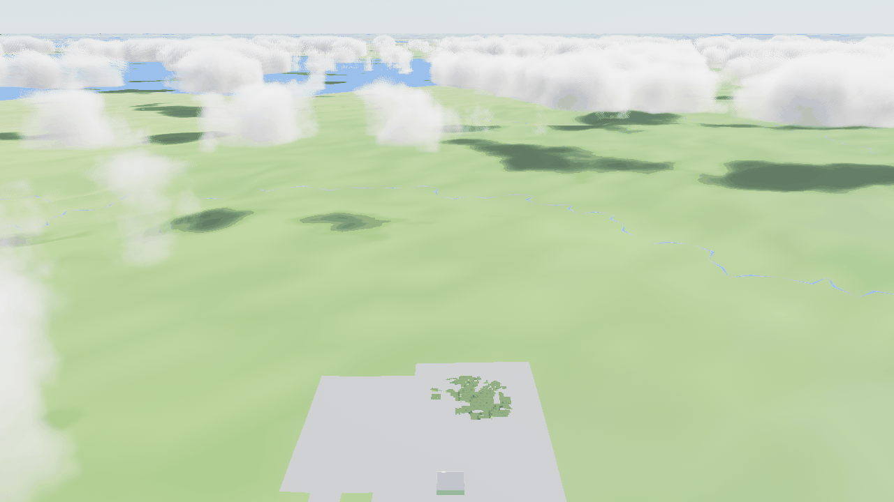

From well above the map: the fine window in the middle, the coarse region heightfield around it, and the world map beyond that.

```sh
DWARF_EYE_HOUR=10:00 DWARF_EYE_VIEW=0,-20 DWARF_EYE_CAM=12 DWARF_EYE_HUD=off DWARF_EYE_SHOT=horizon-height.png:25 ./target/release/dwarf-eye
```

## Walk mode

Tab hands the camera to the adventurer and stands it in the character's tile at eye height. These shots start in walk mode and never step the character.

### Eye level, walk mode

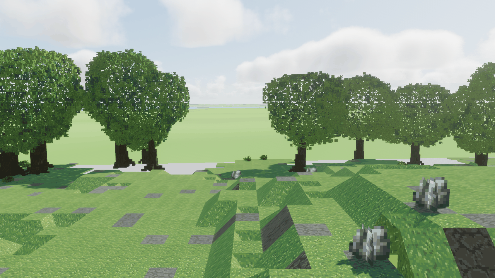

Started in walk sync and left standing: the camera is in the adventurer's tile at eye height, and the character has not moved a step.

```sh
DWARF_EYE_WALK=1 DWARF_EYE_HOUR=09:30 DWARF_EYE_VIEW=0,-6 DWARF_EYE_HUD=off DWARF_EYE_SHOT=walk-eye.png:25 ./target/release/dwarf-eye
```

Re-shoot the lot with `make showcase`; `make showcase-check` re-shoots the
scenes marked `baseline` and reports how far each has drifted.
